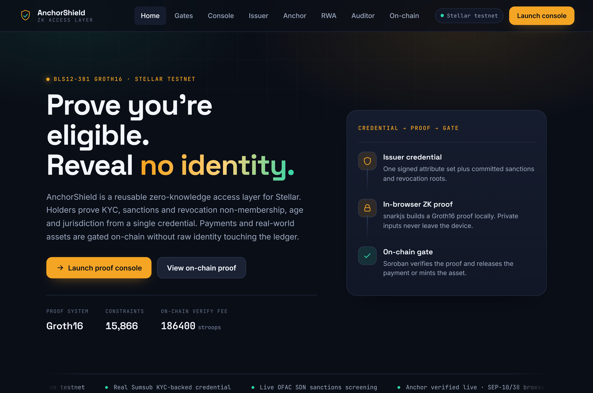
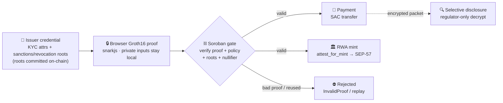
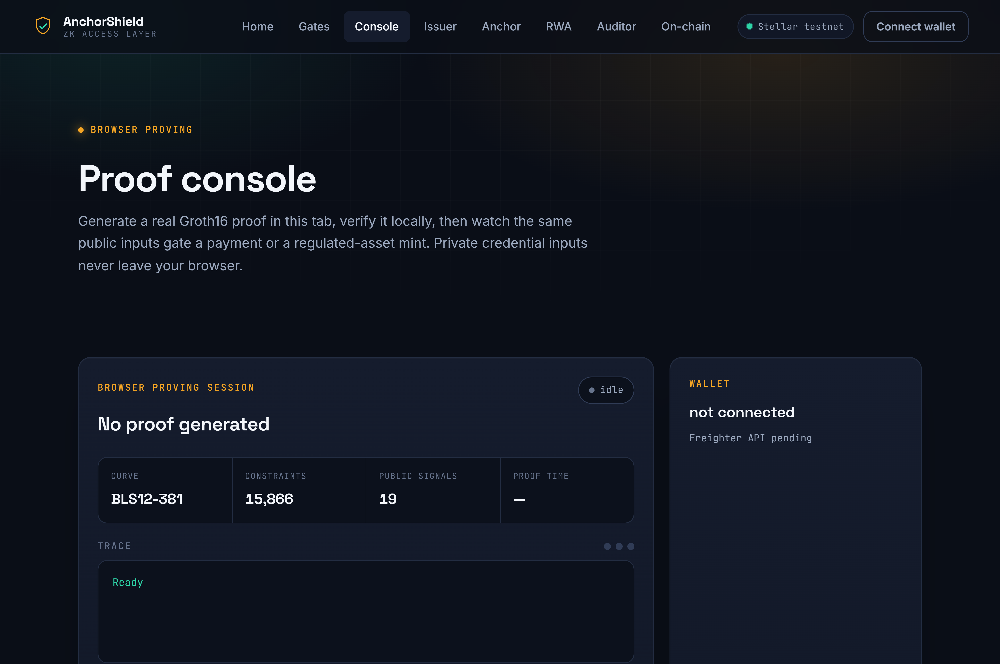
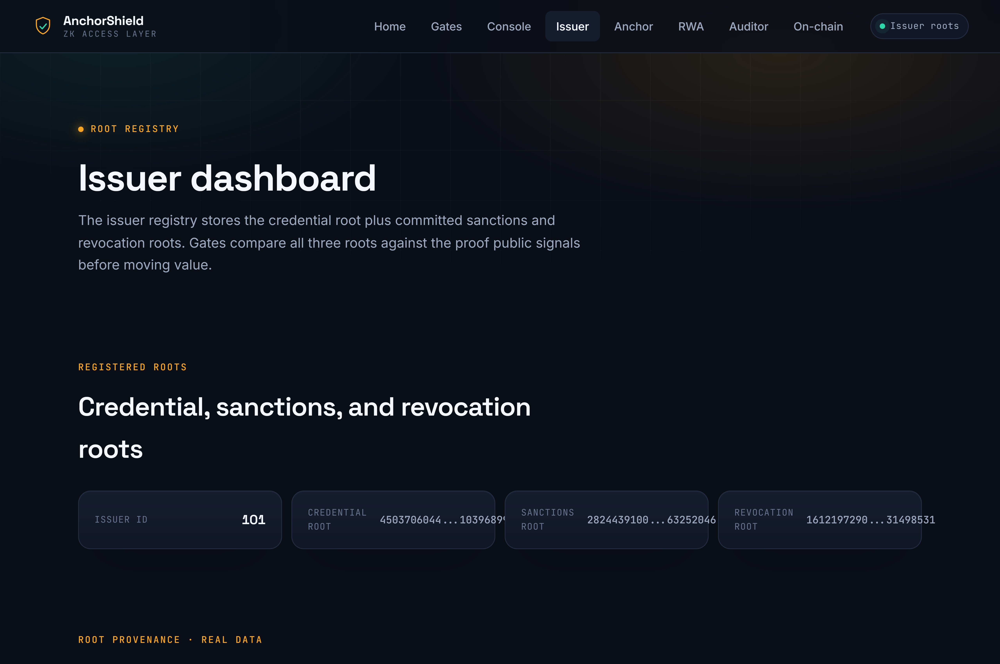
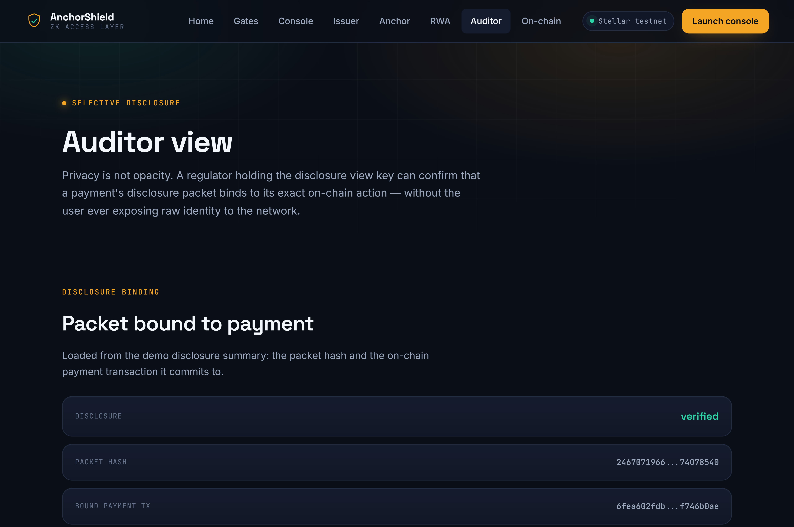

<div align="center">

# AnchorShield

### Prove you're eligible. Reveal no identity.

A reusable **zero-knowledge access layer for Stellar** — holders prove KYC, sanctions and revocation non-membership, age and jurisdiction from a single credential, and payments or real-world assets are gated on-chain **without raw identity touching the ledger**.

[](https://github.com/Ridwannurudeen/anchorshield/actions/workflows/ci.yml)
[](LICENSE)
[](https://stellar.expert/explorer/testnet)
[](circuits/eligibility.circom)
[](contracts/)

**[🌐 Live demo →](https://anchorshield.gudman.xyz)**



</div>

---

## The problem

Compliance on public chains usually means putting identity *on* the chain — KYC attestations, allow-lists, doxxed addresses. That's surveillance, not privacy. AnchorShield flips it: a user proves, in their browser, that they satisfy a policy (KYC-passed, not OFAC-sanctioned, not revoked, of age, in an allowed jurisdiction, bound to *this* action), and the Soroban contract verifies that **proof** before moving value. The ledger sees a valid Groth16 proof and the action — never the identity.

The on-chain gate **cannot execute without a valid proof**: `gate_payment.verify_and_pay` checks the proof, policy fields, committed roots, action binding, packet hash, epoch and nullifier before transferring. A bad proof fails with `InvalidProof`; a replay fails through the nullifier registry.

## How it works



The public statement is limited to proof signals, action data, committed roots, packet hash, nullifier and action binding. Private credential fields and Merkle witnesses never leave the device.

## Live, runnable demo

Everything below runs against **Stellar testnet** at **[anchorshield.gudman.xyz](https://anchorshield.gudman.xyz)** — these aren't mockups, they execute real proofs and on-chain transactions.

| | |
| --- | --- |
| **Proof console** — generate a Groth16 proof in-browser and submit it on-chain with Freighter | **Live KYC** — run a real Sumsub identity verification, mapped to the credential fields |
|  |  |
| **Selective disclosure** — a regulator decrypts the compliance packet in-browser (x25519 → HKDF → AES-GCM); the chain never saw these fields | **Anchor & RWA** — live SEP-10/38 against the SDF reference anchor, and the regulated-asset eligibility proof |
|  | *(see `/anchor` and `/rwa`)* |

## Features

- **In-browser Groth16 proving** for payment and RWA witnesses (snarkjs, BLS12-381).
- **On-chain verification** through a frozen, versioned Groth16 verifier contract on testnet.
- **Action-bound payment** — `gate_payment.verify_and_pay` moves the native SAC only against a valid, non-replayed proof.
- **Action-bound RWA mint** — `identity_verifier.attest_for_mint`, consumed once by `rwa_compliance_adapter` during an OpenZeppelin SEP-57 mint.
- **In-circuit sanctions & revocation non-membership** — a listed party cannot produce a passing proof; roots committed on-chain.
- **Real Sumsub KYC** — the live demo credential is backed by a GREEN Sumsub applicant; a visitor can run their own verification.
- **Live OFAC screening** — the deny list is the real U.S. Treasury OFAC SDN list.
- **Live SEP rails** — SEP-10 auth + SEP-38 quote verified against the SDF public reference anchor.
- **Selective disclosure** — encrypted Travel-Rule packet a regulator decrypts client-side with a view key.
- **Governance, monitoring, indexer** — timelock/multisig governance contract, root-change/duplicate-nullifier alerts, compliance event index.

## Real vs Mock

Honesty matters here. The screening and proof *mechanisms* are real and on-chain; some demo *entities* and tiers are deliberately crafted and disclosed.

| Surface | Status |
| --- | --- |
| ZK proof generation | **Real** Groth16 proof from `circuits/eligibility.circom`. |
| On-chain proof verification | **Real** Soroban verifier on Stellar testnet. |
| Payment execution | **Real** testnet SAC transfer through `gate_payment.verify_and_pay`. |
| RWA mint authorization | **Real** testnet authorization + OZ token mint; the registered minter still controls the mint call. |
| Credential source | Identity attributes (country, DOB→age, KYC pass) come from a **real Sumsub-verified GREEN applicant** (NGA passport); the credential root is published on testnet. Issuer-policy fields (investor type, limits) are issuer-set. See `kyc_provenance` in `services/issuer/data/roster.json`. |
| Sanctions & revocation | **Real** in-circuit non-membership, screened against the **live OFAC SDN list**; roots published on testnet. |
| SEP anchor | Browser flow verifies **SEP-10 + SEP-38 live** against the SDF reference anchor (SEP-12 exercised by script). The `/anchor` dashboard shows a **real captured SEP-38 quote**, not fabricated state. SEP-31 receive-create is **partner-gated** — the SDF reference anchor defines no asset fields, so no fiat transfer is created. A local mock adapter (`services/mock-anchor/`) is retained for offline dev only. |
| Accreditation (`investor_type`) | The RWA gate really enforces `investor_type >= 1`, but the tier is **issuer-asserted, not independently verified** — basic KYC proves identity, not accreditation (a deliberately-deferred gap). |
| Demo blocked-path users | `ofac-hit-banco-nacional-de-cuba` and `revoked-demo-user` are **test fixtures** proving the sanctioned/revoked blocks — the mechanisms are real, the entities are crafted. `clean-demo-user` is real-KYC-backed. |
| Selective disclosure | **Real** X25519→HKDF→AES-GCM decrypt in the browser (verified byte-for-byte against the node reference). The regulator counterparty is a **demo role** (`mock-regulator`) with a published demo view key — there is no real regulator integration. |
| Monitoring & indexer | Monitor logic is real (root-change, duplicate-nullifier, freshness checks) but runs on **fixture events** (`services/monitoring/fixtures/events.json`); wiring it to a live on-chain indexer (`services/indexer/compliance-events.json`) is deferred. |
| Mainnet & governance | **Testnet only.** The timelock/multisig governance contract is built but the live deployment runs a single admin; mainnet needs explicit approval, an independent audit, a production ceremony and a real multisig. |

## Live testnet artifacts

| Artifact | ID / tx |
| --- | --- |
| Verifier | [`CC6SWCQS…2L2I7OCH`](https://stellar.expert/explorer/testnet/contract/CC6SWCQSMNALXV6AUV67I24BQDBSAE33BRQCTMXHGAZKBDVE2L2I7OCH) |
| Issuer registry | [`CDH4LER4…VM5TW7R4`](https://stellar.expert/explorer/testnet/contract/CDH4LER4DMTKKQPBRJNYUJJMFYEDETODHRV7T5VNGBCSGNKRVM5TW7R4) |
| Policy registry | [`CAH5ZI37…ENVKEQFQ`](https://stellar.expert/explorer/testnet/contract/CAH5ZI37PID5IQB7OYB4AU5CJZ7PRLVHVJJ7DDKVP2WHGW4HENVKEQFQ) |
| Nullifier registry | [`CC7KBMVF…YN74BNCT`](https://stellar.expert/explorer/testnet/contract/CC7KBMVFQZ22WH6W6X7D7H6QGY3UIYSE25HL2ZCXQSM5U4BSYN74BNCT) |
| Identity verifier | [`CD647AFZ…OFJKHOB7`](https://stellar.expert/explorer/testnet/contract/CD647AFZSYWVVMBZXNMBIGCADL5FAUDJQDMHJTMVBW5NIGMZOFJKHOB7) |
| RWA compliance adapter | [`CB6KCAGE…2DDJB4NY`](https://stellar.expert/explorer/testnet/contract/CB6KCAGE67EDQWF4K7KQC75ILETMMQK2L5U44AKJ77E7QJS42DDJB4NY) |
| Payment gate | [`CCS7UJWD…T47F5U3R`](https://stellar.expert/explorer/testnet/contract/CCS7UJWD6OP2DGKEGLUCI55SROUC4A3XJ3G4QDQN35HYV3CNT47F5U3R) |
| OZ RWA token | [`CBYALFSE…KIPRHGXT`](https://stellar.expert/explorer/testnet/contract/CBYALFSEIXBLBM23IS4EQMVJXQZYGZNGMDI6NAV3TR7U2JESKIPRHGXT) |
| Payment tx | [`6fea602f…f746b0ae`](https://stellar.expert/explorer/testnet/tx/6fea602fdb2eaf59426271ce17fac7dbc9ed6a04331b5eef34bb4e33f746b0ae) |
| RWA authorization tx | [`fc417569…e95123f2`](https://stellar.expert/explorer/testnet/tx/fc4175698c3a0f8a499f3ce32dd8357169842f6492e291811976bc5fe95123f2) |
| RWA mint tx | [`fca63abf…e1d883b3`](https://stellar.expert/explorer/testnet/tx/fca63abfc08dfaf43b4164d876fbde49e4c5c5171bf332a5c92512cbe1d883b3) |

Full deployment JSON: `deployments/testnet-hardened.json`.

## Tech stack

| Layer | Tech |
| --- | --- |
| Circuits | circom 2.2.3, Groth16 over BLS12-381, custom Poseidon, indexed-Merkle non-membership |
| Proving | snarkjs (in-browser, single-thread) |
| Contracts | Rust / Soroban SDK (Protocol 26), OpenZeppelin SEP-57 |
| Frontend | static HTML/CSS/JS, Freighter wallet, Sumsub WebSDK, CSP + SRI |
| Services | Node (issuer, KYC token backend, anchor SEP client, disclosure, indexer, monitoring) |
| Identity | Sumsub (KYC), U.S. Treasury OFAC SDN (sanctions) |

## Repository layout

```
circuits/        eligibility.circom + Poseidon / Merkle components
contracts/       Soroban: verifier, gates, registries, governance, RWA adapter
services/        issuer, kyc-backend, anchor, disclosure, indexer, monitoring
apps/web/        the live site (pages, assets, vendored snarkjs/stellar-sdk)
packages/        published SDK + CLI, generated bindings
scripts/         verify, ceremony, deploy, preflight, demo-witness
docs/            threat model, security review, ceremony, go-live, deviations
```

## Quickstart

```bash
npm install
npm run m5:verify       # JS checks, audit, circuit smoke, off-chain + Rust tests
npm run m6:verify       # SDK / CLI / bindings
```

Run the browser demo locally:

```bash
npm run m3:web          # serves apps/web on http://localhost:4173 (clean routes)
```

> The demo proves from a **local witness upload** (witness inputs are deliberately not served by the site). Generate the demo witnesses once and upload them on `/console` and `/rwa`:
>
> ```bash
> npm run demo:witness   # writes gitignored demo-witness/{payment,rwa}.json
> ```

Inspect proof signals and events from the CLI:

```bash
node packages/cli/anchorshield.js inspect-public --public testdata/eligibility/public.json
node packages/cli/anchorshield.js validate-action --input testdata/eligibility/input.valid.json --public testdata/eligibility/public.json
```

## Security & limitations

- **Ceremony:** autonomous-tier Groth16 setup, not an independent production ceremony.
- **Verifier governance:** the testnet verifier stores a versioned VK and freezes it after deploy.
- **Admin model:** a timelock/multisig `governance` contract is built, but the live testnet runs a single admin; mainnet cutover needs explicit approval.
- **Web hardening:** witness/proof material is kept out of the public artifact; KYC `/status` is token-gated; the rate limiter trusts only a loopback-set `X-Real-IP`; CSP + SRI are present and CI-guarded.
- **Deployment:** testnet only. No mainnet deploy, package publish, or external submission happens without explicit approval.

See `docs/THREAT_MODEL.md`, `docs/SECURITY_REVIEW.md`, `docs/CEREMONY.md`, `docs/GO_LIVE.md`, `docs/GOVERNANCE.md`, `docs/OPERATIONS.md`, and `docs/DEVIATIONS.md` for full scope.

## License

[Apache-2.0](LICENSE)
